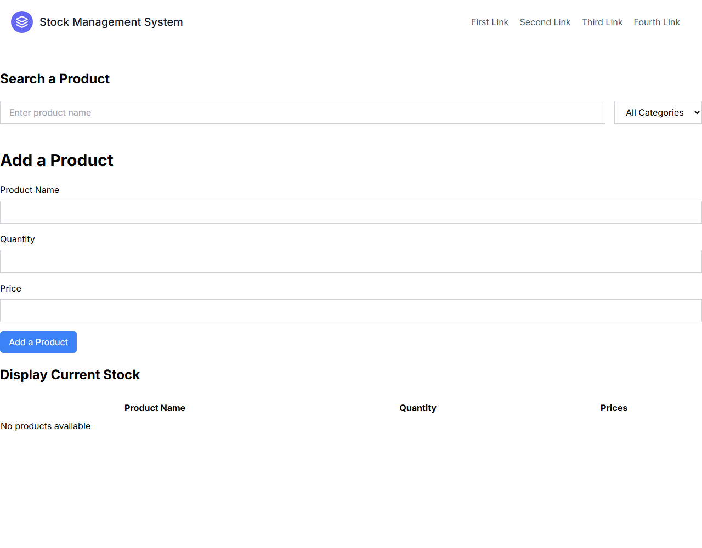

# Stock Management System

A web app for managing product inventory, built with **Next.js** (App Router),
**React**, **Tailwind CSS**, and **MongoDB**. Add products, search the catalogue
with a live dropdown, adjust quantities up or down, and see current stock in a
table - all backed by a MongoDB Atlas database.

## Screenshot



The single-page interface has three sections: **Search a Product** (with a live
type-ahead dropdown), **Add a Product** (name, quantity, price), and **Display
Current Stock** (a table of everything in the database). The screenshot shows it
running without a database configured, so the stock table reads "No products
available".

## Features

- **Add products** with a name, quantity, and price
- **Live search** - typing more than three characters queries MongoDB and shows
  matching products in a dropdown
- **Adjust stock** - plus/minus buttons on each search result update the quantity
  in the database immediately
- **Current stock table** listing every product
- **Graceful no-database mode** - with no connection string set, the UI still
  loads and simply shows an empty stock

## Tech stack

| Layer     | Tool                                        |
|-----------|---------------------------------------------|
| Framework | Next.js 13 (App Router)                     |
| UI        | React, Tailwind CSS                         |
| Database  | MongoDB (via the official `mongodb` driver) |

## API routes

The backend is a set of Next.js route handlers under `app/api/`:

| Route            | Method | Purpose                                       |
|------------------|--------|-----------------------------------------------|
| `/api/product`   | GET    | List all products                             |
| `/api/product`   | POST   | Add a new product                             |
| `/api/action`    | POST   | Increment or decrement a product's quantity   |
| `/api/search`    | GET    | Case-insensitive name search (regex `$match`) |
| `/api/mongo`     | GET    | Scratch/test endpoint                         |

## Getting started

### 1. Clone and install

```bash
git clone https://github.com/DharamVeer970/Stock_management_system.git
cd Stock_management_system
npm install
```

### 2. Configure the database

The MongoDB connection string comes from an environment variable - it is **not**
hardcoded. Copy the example file and fill it in:

```bash
cp .env.example .env.local
```

```ini
MONGODB_URI=mongodb+srv://<user>:<password>@<cluster>/
```

You will need a MongoDB database (e.g. a free
[MongoDB Atlas](https://www.mongodb.com/atlas) cluster) with a database named
`stock` and a collection named `data`.

> Leave `MONGODB_URI` blank to run the UI without a database - the app still
> loads, with an empty stock. `.env.local` is gitignored, so your real
> credentials never get committed.

### 3. Run

```bash
npm run dev
```

Open <http://localhost:3000>.

## Project structure

```
Stock_management_system/
|-- app/
|   |-- page.js               # The single-page UI (search, add, stock table)
|   |-- layout.js             # Root layout
|   |-- globals.css           # Tailwind styles
|   `-- api/
|       |-- product/route.js  # GET list / POST add
|       |-- action/route.js   # POST quantity +/-
|       |-- search/route.js   # GET search
|       `-- mongo/route.js    # Test endpoint
|-- components/
|   `-- Header.js             # Top navigation bar
|-- .env.example              # Copy to .env.local and fill in
|-- next.config.js
`-- package.json
```

## Security note

The MongoDB connection string (with username and password) used to be
**hardcoded in every API route**. It has been moved to the `MONGODB_URI`
environment variable, and `.env.local` is gitignored so credentials stay out of
the repo.

> **Important:** the old credentials are still in this repository's **git
> history**. If that cluster is still live, rotate its password in MongoDB
> Atlas - removing a secret from the current code does not remove it from past
> commits.
