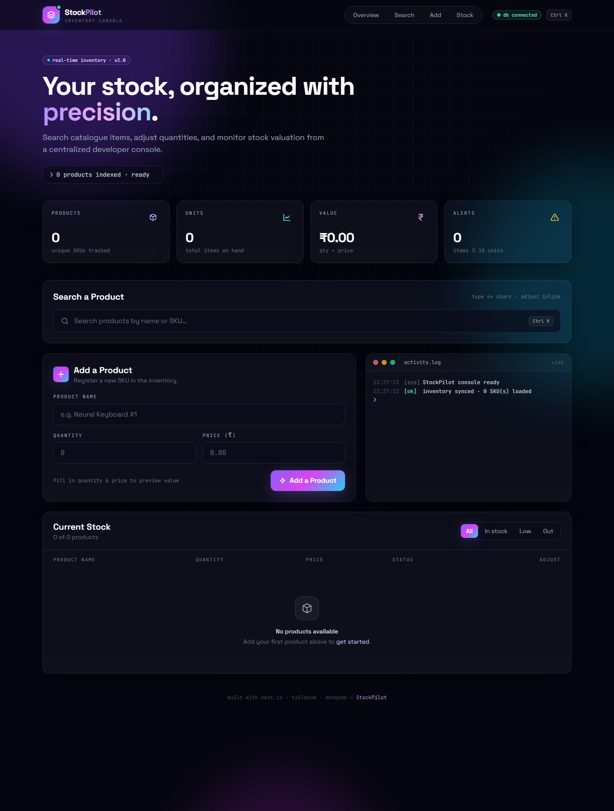

# Stock Management System (StockPilot)

A modern, real-time inventory management console built with **Next.js** (App Router), **React**, **Tailwind CSS**, and **MongoDB**. Manage products, monitor catalogue valuation, search with keyboard shortcuts (`Ctrl + K`), adjust stock levels, and review telemetry events in a developer-console interface.

## Screenshot



## Features

- **Real-Time KPI Cards:** Instant metrics for Total SKUs, Units on hand, Catalogue valuation (₹), and Low-stock alerts (≤ 10 units).
- **Command Palette Search (`Ctrl + K`):** Fast search with keyboard shortcut support and inline `+` / `−` quantity adjustments in search results.
- **Stock Inventory Table:** Visual inventory capacity bars, SKU avatar badges, inline stock adjusters, and tabbed status filters (`All`, `In stock`, `Low`, `Out`).
- **Live Activity Feed (`activity.log`):** Terminal-style log tracking real-time inventory operations (database syncs, searches, product creation, and restock actions).
- **Smart Product Registration:** Form featuring live valuation estimation (`qty × price`) and animated submission states.
- **Graceful Offline Mode:** Real-time database connection pill (`db connected` / `offline mode`). The UI runs smoothly even when `MONGODB_URI` is not configured.

## Tech stack

| Layer     | Tool                                        |
|-----------|---------------------------------------------|
| Framework | Next.js 13 (App Router)                     |
| Styling   | Tailwind CSS                                |
| Database  | MongoDB (via the official `mongodb` driver) |
| Fonts     | Space Grotesk & JetBrains Mono (Next Font)  |

## API routes

The backend is a set of Next.js route handlers under `app/api/`:

| Route            | Method | Purpose                                       |
|------------------|--------|-----------------------------------------------|
| `/api/product`   | GET    | List all products                             |
| `/api/product`   | POST   | Add a new product                             |
| `/api/action`    | POST   | Increment or decrement a product's quantity   |
| `/api/search`    | GET    | Case-insensitive name search (regex `$match`) |
| `/api/mongo`     | GET    | Database connectivity test endpoint           |

## Getting started

### 1. Clone and install

```bash
git clone https://github.com/DharamVeer970/Stock_management_system.git
cd Stock_management_system
npm install
```

### 2. Configure the database (Optional)

The MongoDB connection string comes from an environment variable:

```bash
cp .env.example .env.local
```

```ini
MONGODB_URI=mongodb+srv://<user>:<password>@<cluster>/
```

You will need a MongoDB database (e.g. a free [MongoDB Atlas](https://www.mongodb.com/atlas) cluster) with a database named `stock` and a collection named `data`.

> **Note:** Leave `MONGODB_URI` blank to run in offline mode — the app loads cleanly with an empty stock. `.env.local` is gitignored so credentials never get committed.

### 3. Run the development server

```bash
npm run dev
```

Open [http://localhost:3000](http://localhost:3000) in your browser.

## Project structure

```
Stock_management_system/
|-- app/
|   |-- page.js               # Main inventory console (KPIs, search, log, table)
|   |-- layout.js             # Root layout & ambient grid styling
|   |-- globals.css           # Glassmorphism & custom utility styles
|   `-- api/
|       |-- product/route.js  # GET list / POST add
|       |-- action/route.js   # POST quantity +/-
|       |-- search/route.js   # GET search
|       `-- mongo/route.js    # Test endpoint
|-- components/
|   `-- Header.js             # Sticky console navbar with live status pill
|-- screenshots/
|   `-- app.png               # Dashboard screenshot
|-- .env.example              # Copy to .env.local and fill in
|-- next.config.js
`-- package.json
```

## Security note

The MongoDB connection string is managed securely via the `MONGODB_URI` environment variable, and `.env.local` is excluded from git.
